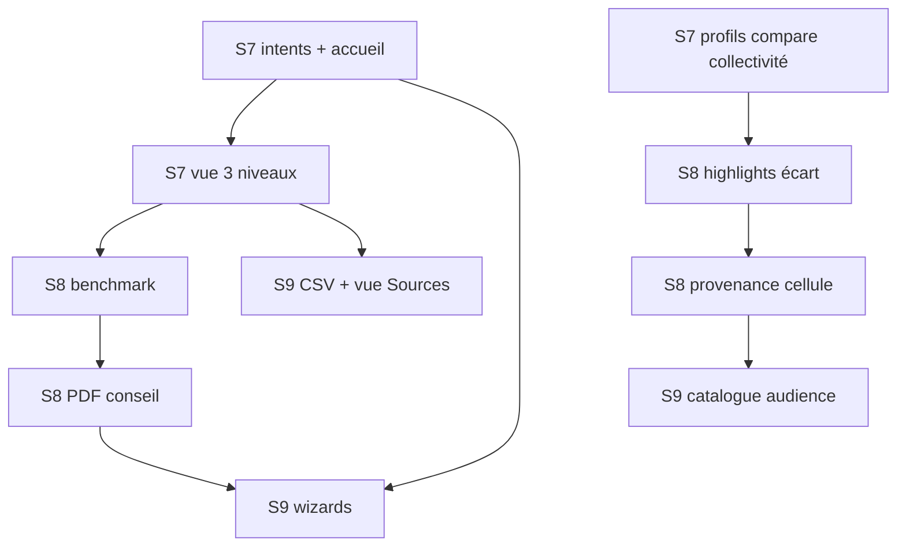

# UX multi-audience — Décision figée & plan d'exécution

**Statut :** décision validée (2026-06-27)  
**Référence :** complète [ux-roadmap.md](./ux-roadmap.md) — sprints 7 à 9

---

## 1. Décision produit (figée)

### Principe directeur

> **Une plateforme de données, plusieurs lentilles de lecture — configurées par intention et partageables par URL.**

- **Une** base de données et **un** catalogue d'indicateurs (`PublicIndicator`).
- **Plusieurs** modes de lecture (niveaux de profondeur, intentions, exports).
- **Pas** de score global unique, **pas** de chat IA libre, **pas** de dashboard multi-widgets.
- Priorité d'usage inchangée : **particuliers** (comparateur) en tête ; élus, cadres, pros servis par **lentilles** et **exports**, pas par des apps séparées.

### Options retenues (A → H)

| Id | Option | Décision |
|----|--------|----------|
| **A** | Accueil **intent-first** (intention, pas persona) | ✅ Retenu — 4 intentions principales |
| **B** | **3 niveaux** sur fiche commune (Synthèse / Analyse / Sources) | ✅ Retenu — remplace le binaire actuel |
| **C** | **État partageable par URL** (`vue`, `priorites`, `benchmark`, `intent`) | ✅ Retenu — source de vérité URL + `localStorage` miroir |
| **D** | **Parcours guidés** (wizard par job-to-be-done) | ✅ Retenu — un wizard par intention majeure |
| **E** | **Highlights contextuels** sans score global | ✅ Retenu — écarts vs EPCI / département / similaires |
| **F** | **Exports différenciés** par audience | ✅ Retenu — PDF, JSON-LD, CSV |
| **G** | **Personnalisation sans compte** | ✅ Retenu — `localStorage` + URL ; compte optionnel hors scope |
| **H** | **IA différenciée** (ton / profil éditorial, pas chat) | ✅ Retenu — réutiliser `editorialProfiles` + modes audience |

### Non-objectifs (figés)

- Menu « Je suis élu / particulier / pro » en première interaction.
- Catalogues d'indicateurs dupliqués par audience.
- Carte interactive lourde (Leaflet / Mapbox).
- Compte utilisateur obligatoire pour personnaliser.
- Ontologie RDF lourde en amont du comparateur.

---

## 2. Modèle d'architecture UX

### 2.1 Intentions (accueil)

| `intent` (URL / carte) | Job-to-be-done | Sortie par défaut |
|------------------------|----------------|-------------------|
| `habiter` | Choisir où habiter | Wizard existant → `/compare` + comparables |
| `comparer` | Comparer 2–5 communes | `/compare` |
| `comprendre` | Comprendre une commune | Recherche → fiche `vue=synthese` |
| `dossier` | Préparer un dossier (élu, cadre) | Fiche `vue=analyse` + benchmark EPCI + PDF |
| `explorer` | Explorer / réutiliser les données | Catalogue API + JSON-LD + doc sources |

Le hero accueil reste orienté **habiter / comparer** ; les autres intentions sont des entrées secondaires explicites (cartes ou section dédiée).

### 2.2 Niveaux fiche commune (`vue`)

| Valeur URL | Libellé UI | Contenu | Rétrocompat |
|------------|------------|---------|-------------|
| `synthese` | Synthèse | `PortraitBlocks` (6 blocs, ~28 indicateurs) | `particulier` (alias) |
| `analyse` | Analyse | KPI hero, IA, sections thématiques, graphiques | `detail` (alias) |
| `sources` | Sources | Traçabilité : liste sources, complétude, liens JSON-LD / catalogue | **nouveau** |

Mémorisation : `localStorage` clé `territoire-portrait:commune-vue` (miroir du param URL).

### 2.3 Paramètres URL (contrat)

| Param | Pages | Exemple | Rôle |
|-------|-------|---------|------|
| `vue` | `/commune/[insee]` | `?vue=analyse` | Niveau de profondeur |
| `priorites` | `/compare` | `?priorites=familial,logement` | Lentille thématique |
| `benchmark` | fiche, compare | `?benchmark=epci` | Référence comparative (`epci`, `departement`, `similaires`) |
| `intent` | accueil (optionnel) | `/?intent=dossier` | Pré-sélection parcours |
| `codes` | `/compare` | `?codes=35238,44109` | Communes comparées |

### 2.4 Profils thématiques comparateur (extension)

Existants (`lib/compare/profiles.ts`) : familial, logement, revenus, equipee, mobile, dynamique, dense.

**À ajouter (collectivité / pro) :**

| id | label | Indicateurs clés (draft) |
|----|-------|--------------------------|
| `fiscalite` | Fiscalité & finances locales | taux fiscalité REI, dette/hab OFGL, recettes |
| `collectivite` | Pilotage communal | rang EPCI, croissance pop., équipements/1 000 |
| `implantation` | Implantation économique | entreprises, emploi salarié, fibre, centralité |

Highlights : formulations **« écart vs [benchmark] »**, jamais « meilleure commune ».

### 2.5 Exports par audience

| Audience | Format | Route / mécanisme | Phase |
|----------|--------|-------------------|-------|
| Particulier | Lien + impression navigateur | existant `@media print` | — |
| Élu / cadre | PDF « fiche conseil » (1 page) | `@media print` ciblé ou route dédiée | 2 |
| Dev / intégrateur | JSON-LD | `/api/commune/…/jsonld`, `/api/compare/jsonld` | amorcé |
| Journaliste / chercheur | CSV indicateurs + métadonnées | `/api/commune/…/indicators.csv` | 3 |

### 2.6 IA par audience

| Mode | Composant | Comportement |
|------|-----------|--------------|
| Grand public | `AiAnalysisClient` | Court, vocabulaire simple, limites explicites |
| Collectivité | `PortraitNarratifClient` | Secteurs + vigilance + opportunités documentées |
| Expert | Fiche `vue=sources` | Pas de synthèse speculative — faits + sources uniquement |

Profils : étendre `lib/analysis/editorial/` avec `audienceTags: ("citizen" \| "collectivity" \| "expert")[]` sur le catalogue.

---

## 3. Plan d'exécution

### Vue d'ensemble

```
Phase 1 (Sprint 7) — Lentilles & intentions     ~2 semaines
Phase 2 (Sprint 8) — Confiance & exports pro    ~2–3 semaines
Phase 3 (Sprint 9) — Wizards & API ouverte      ~2–3 semaines
```

Chaque phase se termine par : `npm run typecheck`, `lint`, `build`, smoke UI fiche + `/compare`.

---

### Sprint 7 — Phase 1 : Intent-first & 3 niveaux fiche

**Objectif :** une entrée multi-intentions et une fiche à 3 profondeurs, sans duplication de données.

#### 7.1 Accueil intent-first

| Tâche | Fichiers | Critères d'acceptation |
|-------|----------|------------------------|
| Définir le catalogue intentions | `lib/ux/intents.ts` (nouveau) | 5 intentions typées, liens, icônes texte |
| Remplacer / compléter `UseCaseCards` | `components/IntentCards.tsx`, `app/page.tsx` | 4–5 cartes avec **parcours complet** (pas seulement ancre) |
| Hero neutre + sous-titre multi-usage | `app/page.tsx` | Habiter reste CTA principal ; autres intentions visibles |
| Tests unitaires intents | `lib/ux/intents.test.ts` | URLs générées stables |

#### 7.2 Fiche commune — 3 niveaux

| Tâche | Fichiers | Critères d'acceptation |
|-------|----------|------------------------|
| Étendre `CommuneViewMode` | `components/commune/CommuneViewToggle.tsx`, `app/commune/[codeInsee]/page.tsx` | `synthese` \| `analyse` \| `sources` ; alias `particulier`/`detail` |
| Persistance vue | `lib/ux/commune-view-store.ts` (nouveau) | `localStorage` + sync URL |
| Vue Sources | `components/commune/CommuneSourcesView.tsx` (nouveau) | Complétude, liste `lib/sources.ts`, liens JSON-LD + catalogue |
| Routage contenu par vue | `app/commune/[codeInsee]/page.tsx` | Pas de régression L1/L2 existants |

#### 7.3 Comparateur — profils collectivité

| Tâche | Fichiers | Critères d'acceptation |
|-------|----------|------------------------|
| Ajouter profils `fiscalite`, `collectivite`, `implantation` | `lib/compare/profiles.ts`, indicateurs associés | Highlights + filtre `priorites` OK |
| Intent « dossier » → compare pré-rempli | `lib/ux/intents.ts` | Lien depuis carte intention |

**Livrable Sprint 7 :** accueil à intentions, fiche 3 niveaux, 3 profils compare collectivité.

---

### Sprint 8 — Phase 2 : Benchmark, confiance, export élu

**Objectif :** contextualiser chaque chiffre ; export conseil municipal ; traçabilité renforcée.

#### 8.1 Benchmark systématique

| Tâche | Fichiers | Critères d'acceptation |
|-------|----------|------------------------|
| Param `benchmark` | `lib/ux/benchmark.ts` (nouveau) | Parse / serialize ; valeurs `epci`, `departement`, `similaires` |
| KPI hero avec écart | `lib/ux/kpis.ts`, `components/KpiHero.tsx` | Libellé « vs moyenne EPCI » quand dispo |
| Highlights compare | `lib/compare/highlights.ts` | Formulation écart, pas superlatif absolu |
| Communes similaires | `lib/compare/comparable.ts` | Réutilisé pour benchmark `similaires` |

#### 8.2 Traçabilité cellule (comparateur + fiche)

| Tâche | Fichiers | Critères d'acceptation |
|-------|----------|------------------------|
| Panneau / tooltip indicateur | `components/IndicatorProvenance.tsx` (nouveau) | Définition, source, millésime, alerte lecture |
| Enrichir catalogue | `lib/indicators/catalog.ts` | `comparisonHint`, `readingAlert` renseignés sur indicateurs compare |
| RGAA panneau | composants ci-dessus | Focus trap, ESC, contraste AA |

#### 8.3 Export PDF fiche conseil

| Tâche | Fichiers | Critères d'acceptation |
|-------|----------|------------------------|
| Styles print « dossier » | `app/globals.css` ou `components/print/` | 1 page : identité, 6 KPI, 3 highlights, sources |
| Bouton « Exporter fiche conseil » | `components/commune/CommuneExportActions.tsx` | Visible en `vue=analyse` ; `window.print()` |
| Intent dossier | accueil → fiche avec query | Parcours documenté dans README |

#### 8.4 IA collectivité

| Tâche | Fichiers | Critères d'acceptation |
|-------|----------|------------------------|
| Tag audience sur profils éditoriaux | `lib/analysis/editorial/editorialProfiles.ts` | Filtre contenu selon `vue` ou intent |
| Visibilité `PortraitNarratifClient` | `app/commune/[codeInsee]/page.tsx` | Promu en `vue=analyse` ; discret en synthèse |

**Livrable Sprint 8 :** benchmark URL, provenance indicateur, PDF conseil, IA contextualisée.

---

### Sprint 9 — Phase 3 : Wizards, CSV, catalogue audience

**Objectif :** parcours guidés restants ; ouverture data ; préparation compte optionnel (sans l'implémenter).

#### 9.1 Wizards par intention

| Parcours | Fichiers | Critères d'acceptation |
|----------|----------|------------------------|
| Benchmark collectivité | `components/wizards/CollectivityBenchmarkWizard.tsx`, `lib/ux/collectivity-profile.ts` | Commune ref → comparables → `/compare?priorites=collectivite,fiscalite` |
| Implantation pro | `components/wizards/ImplantationWizard.tsx` | Thème éco → fiche `vue=analyse#economie` + compare |
| Brief presse | `lib/ux/intents.ts` + ancres | Thème → fiche ancrée + export print |

Réutiliser le pattern `HabitatProfileWizard` + `lib/ux/*-profile-store.ts`.

#### 9.2 Export CSV

| Tâche | Fichiers | Critères d'acceptation |
|-------|----------|------------------------|
| Route CSV commune | `app/api/commune/[codeInsee]/indicators.csv/route.ts` | Colonnes : id, label, value, source, vintage |
| Lien UI vue Sources | `CommuneSourcesView.tsx` | Téléchargement + mention licence sources |

#### 9.3 Catalogue API audience

| Tâche | Fichiers | Critères d'acceptation |
|-------|----------|------------------------|
| `audienceTags` sur entrées catalogue | `lib/indicators/types.ts`, `catalog.ts` | Filtre `?audience=collectivity` sur `/api/indicators/catalog` |
| Doc README | `README.md` | Section « Réutiliser les données » |

#### 9.4 (Optionnel différé) Compte utilisateur

- Sauvegarde comparaisons / favoris : **hors Sprint 9** — noter comme backlog si demande explicite.

**Livrable Sprint 9 :** 2 wizards, CSV, catalogue filtré, doc intégrateurs.

---

## 4. Ordre de dépendances



**Ne pas paralléliser** : extension `vue=sources` (7.2) avant CSV (9.2) et panneau provenance (8.2).

---

## 5. Critères de done globaux

Pour chaque PR / lot :

1. `npm run typecheck && npm run lint && npm run build`
2. Smoke : accueil → intent → fiche ou compare ; toggle 3 niveaux ; lien copié se rouvre identique
3. Pas de régression RGAA comparateur (navigation clavier tableaux)
4. Alias URL rétrocompat (`particulier`, `detail`) conservés au moins 1 release
5. Mise à jour cases `[ ]` → `[x]` dans [ux-roadmap.md](./ux-roadmap.md)

---

## 6. Fichiers clés (cible)

| Fichier | Rôle |
|---------|------|
| `lib/ux/intents.ts` | Catalogue intentions accueil |
| `lib/ux/commune-view-store.ts` | Persistance `vue` |
| `lib/ux/benchmark.ts` | Param benchmark partagé |
| `lib/compare/profiles.ts` | Profils thématiques (+ collectivité) |
| `components/IntentCards.tsx` | Cartes intent-first |
| `components/commune/CommuneSourcesView.tsx` | Niveau L3 Sources |
| `components/IndicatorProvenance.tsx` | Traçabilité cellule |
| `components/wizards/*` | Parcours guidés |
| `docs/ux-multi-audience.md` | Ce document — décision figée |

---

## 7. Références

- [ux-roadmap.md](./ux-roadmap.md) — sprints 7–9 (checklist opérationnelle)
- [.cursor/rules/product-compare.mdc](../.cursor/rules/product-compare.mdc) — principes comparateur
- [AGENTS.md](../AGENTS.md) — workflow agent
